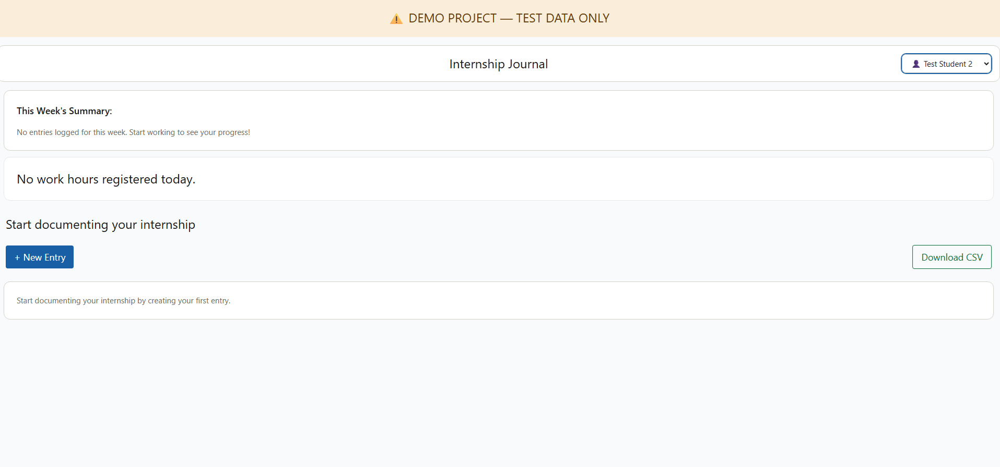
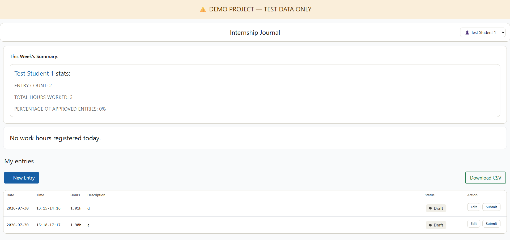
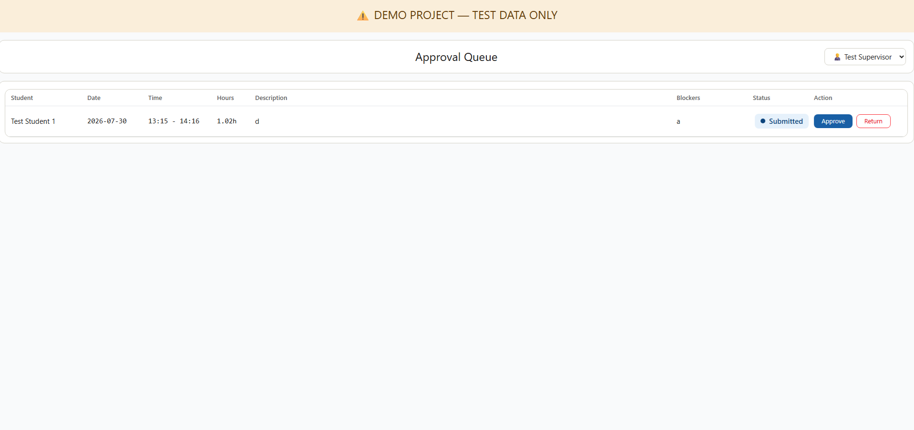

# Internship Journal: End User Guide

Welcome to the Internship Journal! This application helps students document their internship hours and allows supervisors to easily review and approve them. 

Since this is a demo environment, you can switch between different users and roles (Student or Supervisor) using the dropdown menu in the top right corner.

Empty state of Student's view:

---

## 🎓 Student Guide: Logging Your Work

As a student, your main view is the **Internship Journal** dashboard. Here, you can track your weekly stats, monitor your daily hours against your limit, and manage your time entries.

### How to Add a New Entry
1. Click the **+ New Entry** button on your dashboard.
2. Fill out the required fields:
   * **Date**: The day you worked.
   * **Start time & End time**: Your working hours. (The system will automatically calculate the total hours).
   * **Work description**: A brief summary of your tasks.
   * **Blockers** (Optional): Anything that prevented you from working effectively.
3. Click **Save draft**. Your entry is now saved but has not been sent to your supervisor yet.

### How to Edit an Entry
Did you make a mistake? You can edit any entry that is currently a **Draft** or **Needs revision**.
1. Find the entry in your list.
2. Click the **Edit** button next to it.
3. Update your details and click **Update Entry**.

### How to Submit an Entry
Once you are happy with your draft, you need to submit it to your supervisor for approval.
1. Locate the entry in your entries list.
2. Click the **Submit** button. 
3. The status will change to **Submitted**, and it will be sent to your supervisor's queue. *(Note: You cannot edit an entry once it is submitted!)*

---

## 👨‍💼 Supervisor Guide: Reviewing Entries

As a supervisor, your main view is the **Approval Queue**. This dashboard displays all student entries that are currently awaiting your review.

### How to Approve an Entry
1. Review the student's submitted entry (Date, Time, Description, and Blockers).
2. If everything looks good, click the blue **Approve** button.
3. The entry will be permanently marked as **Approved** and removed from your immediate queue.

### How to Return an Entry for Revision
If a student made a mistake (e.g., incorrect hours or vague description), you can send it back to them.
1. Click the red **Return** button next to the entry.
2. A text box will appear below the entry. **You must type a comment** explaining what needs to be fixed.
3. Click **Confirm return**. The entry will be sent back to the student with the status **Needs revision**.

---

## 🚥 Understanding Entry Statuses

Every time entry has a status badge so you know exactly where it stands in the approval process.

*   ⚪ **Draft** (Gray): The entry has been created by the student but is still a work-in-progress. It is visible only to the student and can be freely edited or submitted.
*   🔵 **Submitted** (Blue): The student has finished the entry and sent it for review. The student can no longer edit it, and it now appears in the Supervisor's Approval Queue.
*   🟠 **Needs revision** (Amber/Orange): The supervisor reviewed the entry but found an issue. It has been sent back to the student with a mandatory feedback comment. The student must edit and re-submit it.
*   🟢 **Approved** (Green): The supervisor has verified and accepted the entry. The hours are officially logged, and no further action is required from either party.

